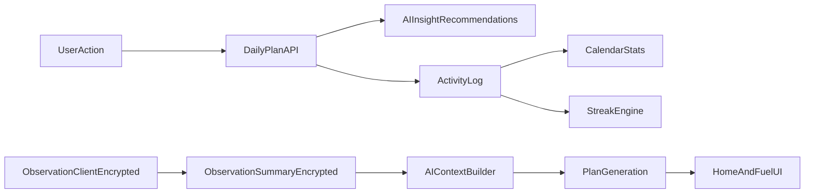

<div align="center">
  <h1>🌟 FitNexus</h1>
  <p><strong>The wellness application that turns your profile, habits, and daily signals into a structured health plan.</strong></p>
  
  
  
  
  
  
</div>

---

**FitNexus** is the flagship wellness application in the **numbers-don’t-lie** repository. It adapts your goals into a personalized strategy—movement, nutrition, and mindfulness—ensuring recommendations stay grounded in what you actually do. 

---

## 📑 Table of Contents

1. [✨ Capabilities](#-capabilities)
2. [🛠 Tech Stack](#-tech-stack)
3. [🚀 Getting Started](#-getting-started)
4. [⚙️ Environment Variables](#️-environment-variables)
5. [🗄️ Database Reset & Clean Installs](#️-database-reset--clean-installs)
6. [🔐 Security](#-security)
7. [📱 Using the Application](#-using-the-application)
8. [🤖 AI, Observations & Fallbacks](#-ai-observations--fallbacks)
9. [🔄 Data Flow](#-data-flow)
10. [🏗 Architecture Notes](#-architecture-notes)
11. [📂 Repository Layout](#-repository-layout)
12. [❓ Troubleshooting](#-troubleshooting)

---

## ✨ Capabilities

| Area | Description |
|------|-------------|
| 🎯 **Multi-goal Onboarding** | Select **1–3** wellness goals; strategy adapts (focused vs. balanced) based on selection. |
| 📋 **Daily Top 3 Plan** | AI-generated movement, nutrition, and mindfulness actions with **persistent completion** (no duplicate counts). |
| 🗓️ **Activity & Calendar** | Completing Top 3 actions reflects in **activity logs** and **calendar** so streaks stay consistent. |
| 🥗 **Nutrition & Recipes** | Meal-of-the-day guidance, **allergy/restriction-aware** recipe filtering, and expanded catalogs (vegan/plant-forward). |
| 🧘 **Inspire Me** | Curated mindfulness, breathing, and meditation guidance under Fuel; includes a **bundled offline fallback**. |
| 👁️ **Observation Layer** | Encrypted local cache and **server-side encrypted summaries** of check-ins (food, water, sleep, stress). AI uses **aggregates**, protecting raw sensitive events. |
| 📊 **Wellness Score & Trends** | Composite **0–100** score, weight trends, habit streaks, and weekly AI summaries. |
| 🔋 **Preserve Mode** | When indicating burnout, plans shift automatically toward recovery-oriented actions. |
| 🔑 **Authentication & Data** | Email/password, optional GitHub/Google OAuth, **TOTP 2FA**, and **JSON data export**. |

---

## 🛠 Tech Stack

| Layer | Technologies |
|-------|----------------|
| **Framework** | Next.js 16, React 19, TypeScript 5 |
| **Styling & Motion** | Tailwind CSS 4, Framer Motion |
| **3D Rendering** | Three.js, React Three Fiber, Drei |
| **UI Components** | Radix UI, Lucide, Recharts |
| **Data & ORM** | PostgreSQL 16 (Docker), Prisma 7 |
| **Authentication**| Auth.js / NextAuth 5 (beta) — credentials, OAuth, 2FA |
| **AI Integration**| OpenRouter API (OpenAI-compatible) |
| **Email** | Gmail SMTP (primary) + Resend fallback |
| **Forms** | React Hook Form, Zod 4 |

---

## 🚀 Getting Started

### Prerequisites

- **Node.js 22+**
- **Docker & Docker Compose** (for PostgreSQL and optional full-stack run)

### Commands Cheat Sheet (Start / Stop / Restart)

#### Local dev (Next.js on host, Postgres in Docker)

```bash
# Start database
docker compose up -d db

# Stop database (keeps data)
docker compose stop db

# Restart database
docker compose restart db

# Start dev server
npm run dev
```

#### Full stack in Docker (App + Postgres)

```bash
# Start (build if needed)
docker compose up -d --build

# Stop containers (keeps data)
docker compose stop

# Start again
docker compose start

# Restart all containers
docker compose restart

# Stop + remove containers + delete DB volume (full reset)
docker compose down -v
```

### Local Development

Get up and running quickly with a local Node server and a Dockerized database:

```bash
# 1. Install dependencies
npm install

# 2. Setup your environment variables
cp .env.example .env

# 3. Start the PostgreSQL database
docker compose up -d db

# 4. Run migrations and generate the Prisma client
npx prisma migrate deploy
npx prisma generate

# 5. Start the development server
npm run dev

```

Open **`http://localhost:3000`**. You should see the landing page with the interactive 3D wellness orb! 🌍

### Full Stack with Docker

Run the application and database entirely in containers (no local Node required):

```bash
cp .env.example .env

# Optional: Free ports if something is already bound
kill -9 $(lsof -t -i:3000) $(lsof -t -i:5433) 2>/dev/null || true

# Build and start the services
docker compose up -d --build

#Stop running containers (keep data/volumes):
docker compose stop

# Start again:
docker compose start
```
> **Note:** Set `DATABASE_URL` in `.env` before building. The image build runs `prisma generate` and `next build` using that connection string.

#### Faster Docker rebuilds (BuildKit cache)

If you build frequently (especially in CI), enable BuildKit inline cache:

```bash
docker buildx build \
  --cache-to=type=inline \
  --cache-from=type=registry,ref=yourimage:tag \
  -t yourimage:tag .
```

#### Which dev workflow to use?

- **Fastest inner loop**: local `npm run dev` + `docker compose up -d db`
- **All-in-Docker**: `docker compose up -d --build`
- **Hot reload in Docker**: use `Dockerfile.dev` + `docker-compose.dev.yml` (bind-mount source, no rebuilds on code changes)

### Troubleshooting (Common Issues)

#### App falls back to offline plans (AI not used)

- Ensure you set **both** a key and a model in `.env`:
  - `OPENROUTER_API_KEY=...`
  - `OPENROUTER_MODEL=openai/gpt-5-nano` (example)
- In dev, enable the request/response inspector:

```bash
AI_IO_LOG=1 npm run dev
```

Then open **`/settings/ai-io`** to verify the request payload and the model response.

#### Prisma errors / DB connection refused

- Confirm Postgres is running:

```bash
docker compose ps
```

- Re-run Prisma after DB is up:

```bash
npx prisma migrate deploy
npx prisma generate
```

#### “Email already exists” during local testing

Emails are unique in Postgres. Reset the DB if you want to re-register with the same email:

```bash
docker compose down -v
docker compose up -d db
npx prisma migrate deploy
npx prisma generate
```

---

## ⚙️ Environment Variables

Create `.env` from `.env.example`. **Never commit secrets to version control.**

<details>
<summary><b>Click to view required environment variables</b></summary>

| Variable | Purpose |
|----------|---------|
| `DATABASE_URL` | PostgreSQL connection string. (e.g., `postgresql://...localhost:5433/fitnexus_db`) |
| `NEXTAUTH_SECRET` | Random secret; e.g. `openssl rand -base64 32`. |
| `APP_JWT_SECRET` | Secret for API access-token signing (recommended, can match `NEXTAUTH_SECRET`). |
| `NEXTAUTH_URL` | App origin, e.g. `http://localhost:3000`. |
| `AUTH_SECRET` | Same value as `NEXTAUTH_SECRET` (used in Docker-oriented Auth.js setup). |
| `AUTH_URL` | Auth base URL, e.g. `http://localhost:3000/api/auth`. |
| `AUTH_TRUST_HOST` | Set to `true` when running behind Docker or a reverse proxy. |
| `OPENROUTER_API_KEY` or `OPENAI_API_KEY` | LLM provider key (`OPENROUTER_API_KEY` takes precedence if both are set). |

</details>

<details>
<summary><b>Click to view optional environment variables</b></summary>

| Variable | Purpose |
|----------|---------|
| `GITHUB_CLIENT_ID` / `SECRET` | GitHub OAuth—[Developer Settings](https://github.com/settings/developers). |
| `GOOGLE_CLIENT_ID` / `SECRET` | Google OAuth—[Google Cloud Console](https://console.cloud.google.com/). |
| `SMTP_HOST`, `PORT`, `USER`, `PASS` | Outbound email. Gmail often uses an [App Password](https://myaccount.google.com/apppasswords). |
| `RESEND_API_KEY` | Optional fallback email provider via [Resend](https://resend.com/api-keys). |
| `EMAIL_FROM` | From address, e.g. `FitNexus <you@gmail.com>`. |
| `NEXT_PUBLIC_APP_URL` | Public app origin used in verification/reset email links. For Gmail/Outlook testing, use a reachable URL (deployed domain or tunnel), not localhost. |
| `NEXT_PUBLIC_EMAIL_LOGO_URL` | Public HTTPS URL for email logo image (PNG/JPG preferred). Localhost URLs are not reachable by webmail proxy fetchers. |
| `EMAIL_INLINE_LOGO_PATH` | Optional local image file path (PNG/JPG/GIF/WEBP) embedded inline via CID for stronger client compatibility. |
| `EMAIL_INLINE_LOGO_URL` | Optional public HTTPS image URL fetched and embedded inline via CID when file path is not provided. |
| `OPENROUTER_MODEL` | **Required** when using OpenRouter. Example: `openai/gpt-5-nano` (or any OpenRouter chat/instruction model). |
| `OPENAI_API_KEY`, `OPENAI_MODEL`, `OPENAI_BASE_URL` | Optional OpenAI/OpenAI-compatible fallback configuration. |
| `APP_FIELD_ENCRYPTION_KEY` | Optional dedicated key for field/shadow encryption (falls back to `NEXTAUTH_SECRET` if omitted). |

> If OAuth and outbound email are omitted, social login and automated email flows are limited. If no valid LLM key is available (`OPENROUTER_API_KEY` or `OPENAI_API_KEY`), the app uses fallback plans.
>
> Email logo note: webmail clients (Gmail/Outlook) load images from remote proxy servers, so `localhost` image URLs do not render there. Prefer a public HTTPS logo URL and/or CID inline logo embedding.
> The repo includes a local default inline logo at `public/fitnexus-email-logo.png` and `.env.example` points `EMAIL_INLINE_LOGO_PATH` to it.
</details>

---

## 🗄️ Database Reset & Clean Installs

Emails are unique in Postgres. To **register again with the same address** during testing, you must reset the database or delete the user row.

### Reset with Docker volume removal (Typical Local Dev)
```bash
docker compose down -v
docker compose up -d db
# Wait ~5s for Postgres to accept connections
npx prisma migrate deploy
npx prisma generate
```

### Full stack Reset (App + DB in Docker)
```bash
docker compose down -v
docker compose up -d --build
```
> The `-v` flag removes the named Postgres volume. Without `-v`, existing data heavily persists.

---

## 🔐 Security

For encryption at rest and in transit, secret handling, and active threat mitigation practices, please refer to our **`SECURITY.md`**.

---

## 📱 Using the Application

| Route | Description |
|-------|-------------|
| **`/`** | Landing page: 3D wellness orb, feature overview, and how it works. |
| **`/signup`** | Registration via email/password or OAuth. |
| **`/onboarding`** | Six-step profile wizard: basics, goals, diet, fitness, lifestyle, and baseline stress. |
| **`/home`** | Command Center: Daily AI plan (Top 3), stress check-in, dynamic insights, meal of the day. |
| **`/fuel`** | Nutrition: meal guidance, logs; **`/fuel/recipes`** for allergy-aware browsing. |
| **`/vitality`** | Logging check-ins, tracking streaks, interactive **activity calendar**. |
| **`/blueprint`** | Settings: Wellness score detail, weight trend profile, security (2FA), and data export. |

---

## 🤖 AI, Observations & Fallbacks

**Daily plans** dynamically utilize your profile, recent habits (sleep, hydration, burnout flags), and **aggregated observation signals** so suggestions stay highly relevant without exposing raw sensitive data to the LLM.

If the OpenRouter/OpenAI key is absent or the API errors out, the system falls back to cached or deterministic plans and sets a `fallbackUsed` flag so the UI can gracefully distinguish AI output from locally bundled content.

### Dev: AI I/O Inspector (Request + Response)

To see **exactly what prompt/messages/tools we sent** and **what we got back** from the model in local development:

```bash
# Enable dev-only AI request/response logging
AI_IO_LOG=1 npm run dev
```

- UI viewer: **`/settings/ai-io`** (shows the last ~50 generations for the current dev server process)
- Raw JSON: **`GET /api/dev/ai-io`**
- Clear: **`GET /api/dev/ai-io?clear=1`**

> Note: OpenRouter's dashboard message “I/O logging is not enabled” is an **OpenRouter-side** setting. The inspector above logs inside the app in dev mode regardless of OpenRouter dashboard logging.

### Hallucination Handling Strategy

- A dedicated post-generation verifier checks AI output shape, category validity, medical-risk phrases, and dietary-restriction conflicts before a plan is accepted.
- If verifier checks fail, the generation is rejected and the system falls back to:
  1) a previously cached validated plan (database-backed shared cache), or
  2) deterministic rules fallback.
- This creates a guardrail stage between model output and user-visible recommendations.

### Model Selection Tradeoffs (Quality vs Latency)

- The default model favors plan quality and contextual grounding over minimum latency.
- Lower-latency models can be configured with `OPENROUTER_MODEL`, but may reduce recommendation specificity and consistency.
- Guardrails and fallback logic are model-agnostic so safety behavior remains stable when model choice changes.

### Caching Strategy (Regeneration vs Reuse)

- AI daily-plan responses are cached in PostgreSQL (`AiResponseCache`) with TTL, enabling reuse across all app instances.
- On provider outages or key absence, the API serves the last validated cached plan first, then deterministic fallback if cache is unavailable.
- Regeneration still occurs on successful provider calls to keep recommendations fresh.

### PII-Removal and BMI Impact Notes

- PII minimization improves privacy posture but can reduce hyper-personal tone (for example, hobby-name-specific coaching language).
- Core behavioral metrics are retained to preserve actionable personalization while avoiding direct identifiers.
- BMI contributes to wellness scoring as one component; category transitions can shift score trends. This is useful for directionality but should be interpreted alongside activity, habits, and goal progress rather than as a standalone health diagnosis.

---

## 🔄 Data Flow



---

## 🏗 Architecture Notes

- **Prisma 7** uses `prisma.config.ts` with a **PostgreSQL adapter** (`PrismaPg`).
- **Auth.js** is split into an **edge-safe config** for middleware and a **full server config** with Prisma bindings.
- **AI Clients** are initialized **lazily** on first use so builds succeed without an API key.
- **Docker** leverages a multi-stage `Dockerfile` configured for Next.js **standalone** outputs.
- **Environment encryption:** See `scripts/env-crypto.mjs` (AES-256-GCM) — `npm run env.encrypt` / `npm run env.decrypt`.

---

## 📂 Repository Layout

```text
src/
├── app/
│   ├── (app)/              # Authenticated layout: home, fuel, vitality, blueprint
│   ├── (auth)/             # Login, signup, verify, reset
│   ├── api/                # REST handlers (auth, plan, insights)
│   └── onboarding/         # Profile wizard
├── components/
│   ├── three/              # 3D orb implementation
│   └── (home|fuel|charts)/ # Feature-specific UI components
└── lib/
    ├── ai/                 # LLM prompts, context builders
    └── (prisma|auth)/      # Core integrations
prisma/
├── schema.prisma           # Database architecture
└── migrations/             # SQL Migrations
```

---

## ❓ Troubleshooting

| Symptom | Fix |
|---------|-------------|
| `ECONNREFUSED` (Database) | Start Postgres: `docker compose up -d db` |
| `UntrustedHost` (Docker auth) | Set `AUTH_TRUST_HOST=true` in `.env` |
| Port 3000 in use | Kill the process or swap ports in `.env`/compose |
| `npm install` peer conflicts | Use `npm install --legacy-peer-deps` |
| Empty AI Plans / Errors | Check `OPENROUTER_API_KEY` / `OPENAI_API_KEY`, model settings, then restart app/container after `.env` edits |
| Login fails after sign-up | Ensure `RESEND_API_KEY` / SMTP is set, or verify user row manually in DB for local testing. |

---

<p align="center">
  <i>Repository name: <b>numbers-don’t-lie</b>. Product name: <b>FitNexus</b>.</i>
</p>
